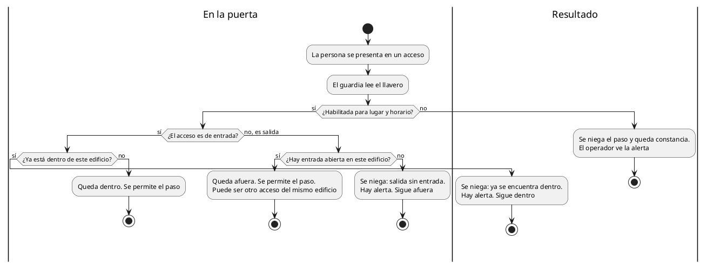
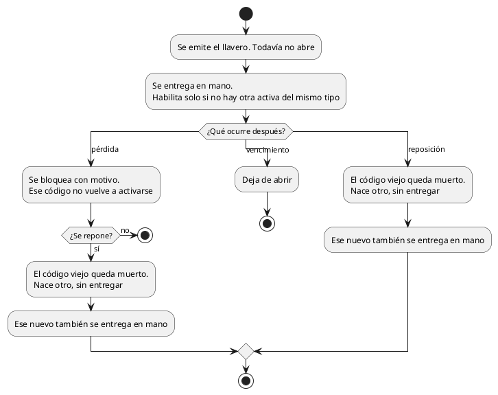
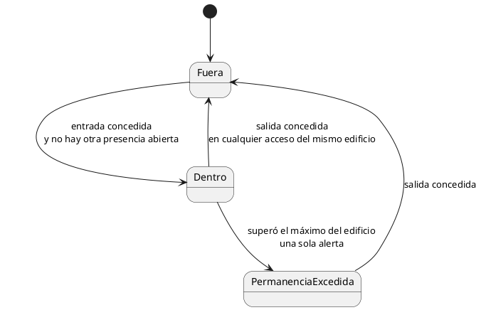
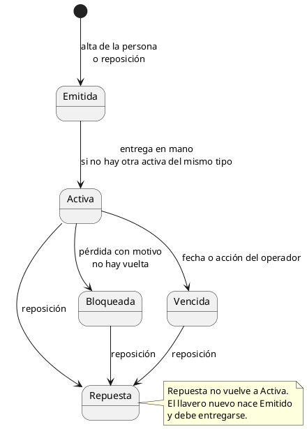
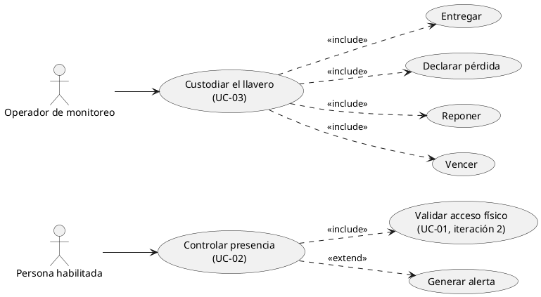

# Brief para rehacer el PDF — Parcial I de Trabajo de Diploma

Pegale este archivo entero a la otra IA. El texto de abajo es la fuente. No hay que inventar reglas, nombres ni fechas. Los diagramas del PDF viejo salieron mal: hay que redibujarlos con una herramienta de verdad (PlantUML, diagrams.net o StarUML), no con cajas SVG a mano.

## Cómo tiene que quedar el PDF

- Idioma: español. Tono de informe universitario, impersonal. No menciones a una IA.
- Formato: A4, portada, resumen ejecutivo, índice con números de página, encabezado discreto, numeración.
- Portada:
  - Universidad Abierta Interamericana
  - Facultad de Tecnología Informática
  - Ingeniería en Sistemas Informáticos
  - Trabajo de Diploma — Evaluación parcial N° I
  - Título: Sistema de Gestión y Control de Accesos Físicos APL
  - Sigla: SGCA-APL
  - Subtítulo: Iteración 3 — Presencia en el edificio y ciclo de vida del llavero
  - Alumno: Komorovski, Luciano Jesus
  - Docente: Ing. Pablo Audoglio
  - Sede: Rosario. Localización: Lagos. Turno: Tarde. Modalidad: Individual
  - Fecha: 29 de septiembre de 2026
- La descripción del apartado 1.3 no puede pasar de 200 palabras. El texto de abajo ya entra. No le agregues una nota del estilo «menos de 200 palabras».
- Esta entrega llega hasta el diseño preliminar. No pongas diagrama de secuencia, diagrama de clases con métodos, ni diagrama entidad-relación de la base. Eso ya se entregó en el Parcial II de Ingeniería de Software (07/07/2026).
- No pegues código fuente.
- Los procesos de negocio se cuentan desde la guardia y la administración, no desde el software. El sistema interviene el proceso; no es el proceso.
- Objetivos en infinitivo, medibles, con fecha. No son funciones de pantalla.

## Reglas que no se pueden cambiar

Presencia, por persona y por edificio:

- Fuera → Dentro: entrada concedida, y no hay otra presencia abierta en ese edificio.
- Dentro → Fuera: salida concedida por cualquier acceso del mismo edificio, aunque no sea el tótem de la entrada.
- Dentro → Permanencia excedida: superó el máximo de horas de ese edificio. Una sola alerta. No impide la salida.
- Permanencia excedida → Fuera: misma regla que la salida.
- Segunda entrada con presencia abierta: no es transición. Se niega con el motivo «ya se encuentra dentro» y hay alerta.
- Salida sin entrada abierta: no es transición. Se niega con el motivo «salida sin entrada» y hay alerta.
- Esas dos reglas corren solo si el pase ya era válido por credencial, edificio, zona y horario.
- Una persona sin edificio fijo (personal de servicio) puede estar dentro en dos edificios a la vez.
- El máximo de referencia es 12 horas, y es un dato de cada edificio.

Llavero:

- Estados: Emitida, Activa, Bloqueada, Vencida, Repuesta.
- Alta y reposición crean el llavero en Emitida. En ese estado no abre. Motivo: «credencial sin entregar».
- Emitida → Activa solo con la entrega en mano, y solo si no hay otra credencial activa del mismo tipo. Peatonal y cochera son tipos distintos y pueden estar activas juntas. Dos peatonales activas, no.
- Activa → Bloqueada exige motivo de pérdida. No hay vuelta a Activa.
- Activa → Vencida por fecha o por acción del operador.
- Activa, Bloqueada o Vencida → Repuesta al reponer. El código viejo no abre. Motivo: «credencial reemplazada». El código nuevo nace Emitido y hay que entregarlo.
- Un formulario no puede saltar el estado. Esa corrección se rechaza.

Motivos literales que tiene que decir el informe: «ya se encuentra dentro», «salida sin entrada», «credencial sin entregar», «credencial reemplazada», «tarjeta bloqueada».

Datos de la demostración, no los cambies: María Gómez, llavero TAG-PEL-01, dentro del Consorcio Pellegrini. Ana, TAG-EMI-01, emitida. Jorge, TAG-REP-01 repuesta y TAG-NUEVA-01 emitida. Operadora: Lucía, turno tarde. Cliente: Alejandro, APL, Rosario. Edificios de ejemplo: Consorcio Pellegrini, Oficinas Macrocentro, Depósito Fisherton.

## Diagramas a redibujar

Usá los bloques PlantUML de más abajo. Renderizalos a imagen nítida e insertalos en el informe con el epígrafe indicado. No reutilices los dibujos del PDF anterior.

La permanencia excedida no es un rombo dentro del pase. Es una vigilancia mientras la persona está dentro: si supera el máximo, una alerta, y la salida sigue permitida. Eso va como nota del diagrama de actividad, y como estado en el diagrama de estados.

### Actividad — control de permanencia

Epígrafe: Figura. Actividad del control de permanencia. La decisión de lugar y horario es la de la iteración 2. Si ya quedó dentro y supera el máximo del edificio, el operador recibe una sola alerta y la salida posterior sigue el camino de «hay entrada abierta».

### Actividad — custodia del llavero

Epígrafe: Figura. Actividad de la custodia del llavero. La emisión y la reposición convergen en la entrega en mano.

### Estados — presencia en un edificio

Epígrafe: Figura. Estados de la presencia en un edificio.

Debajo, esta tabla. Las dos últimas filas son rechazos, no flechas del diagrama.

| Transición | Regla |
| --- | --- |
| Fuera → Dentro | El pase de entrada ya superó credencial, edificio, zona y horario, y no hay otra presencia abierta de esa persona en ese edificio. |
| Dentro → Fuera | El pase es de salida, en cualquier acceso del mismo edificio, y la presencia sigue abierta. |
| Dentro → Permanencia excedida | El tiempo desde el ingreso supera el máximo del edificio. Una sola alerta. No se niega la salida posterior. |
| Permanencia excedida → Fuera | Misma regla que la salida desde Dentro. |
| Segunda entrada | No es transición. Motivo «ya se encuentra dentro». Hay alerta. La persona sigue dentro. |
| Salida sin entrada | No es transición. Motivo «salida sin entrada». Hay alerta. La persona sigue afuera. |

### Estados — llavero

Epígrafe: Figura. Estados del llavero. Reponer no reactiva el código viejo: lo deja en Repuesta y nace otro en Emitida.

| Transición | Regla |
| --- | --- |
| Inicio → Emitida | El alta o la reposición crea el llavero en Emitida. No abre. |
| Emitida → Activa | Entrega en mano. Se rechaza si ya hay otra activa del mismo tipo. Cochera y peatonal conviven. |
| Activa → Bloqueada | Motivo escrito de pérdida. No existe Bloqueada → Activa. |
| Activa → Vencida | Llegó la fecha, o el operador marca el vencimiento. |
| Activa, Bloqueada o Vencida → Repuesta | Hay un código nuevo. El anterior no abre. El nuevo queda Emitido. |

### Casos de uso

Epígrafe: Figura. Casos de uso de la iteración 3. Controlar presencia incluye la validación ya entregada y se extiende con la alerta cuando el pase de presencia se niega o cuando se excede la permanencia.

Texto que va debajo: no hay presencia si UC-01 rechazó el pase. La extensión hacia la alerta ocurre en la entrada duplicada, en la salida sin entrada y en la permanencia excedida. Custodiar el llavero solo llega a entregar, declarar pérdida, reponer o vencer si el estado actual lo permite.

### Dominio conceptual

Cajas, sin atributos de programación. Relaciones:

- Edificio 1 — * Persona habilitada. La persona puede no tener edificio (personal de servicio).
- Persona habilitada 1 — * Llavero.
- Llavero 1 — * Movimiento de custodia.
- Edificio 1 — * Zona. Zona 0..1 — * Zona hija.
- Nivel * — * Zona. Nivel 1 — * Horario.
- Persona habilitada * — 0..1 Nivel.
- Persona habilitada + Edificio 1 — 0..1 Presencia abierta.
- Zona 1 — * Puesto de acceso. El puesto tiene sentido entrada o salida.
- Puesto 1 — * Pase. El pase es el hecho histórico.
- La presencia es la situación actual, distinta del pase.
- Alerta * — 1 puesto. Operador atiende la alerta.

Epígrafe: Figura. Dominio conceptual. La presencia no es el historial de pases.

### Dominio actualizado

Mismo modelo, ahora con atributos y multiplicidad. Puede partirse en dos figuras si no entra en una página. No agregues métodos.

- Edificio: nombre, dirección, horas de permanencia máxima. 1 — * personas, zonas, presencias.
- Persona habilitada: nombre, apellido, documento, estado activo o inactivo, edificio 0..1, nivel 0..1. 1 — * llaveros. 1 — * presencias.
- Llavero: código único, tipo peatonal o cochera, estado, motivo del estado, fecha de entrega, vencimiento, reemplaza 0..1 llavero. 1 — * movimientos de custodia.
- Movimiento de custodia: estado origen, estado destino, motivo, momento, operador 0..1.
- Presencia: estado dentro, permanencia excedida o fuera; ingreso; egreso; persona; edificio; llavero; pase de entrada; pase de salida. Como máximo una abierta por persona y edificio.
- Nivel: nombre. * zonas. 1 — * horarios.
- Zona: nombre, nivel de seguridad, zona padre 0..1, edificio 1. 1 — * puestos.
- Puesto de acceso: descripción, ubicación, sentido entrada o salida, zona 1.
- Pase: momento, sentido, resultado, motivo de rechazo, controlador 0..1, llavero 0..1. No se reescribe.
- Alerta: tipo, gravedad, momento, estado de atención, controlador 1, resolución 0..1 con operador.
- Operador: usuario, turno. 1 — * resoluciones. 1 — * movimientos de custodia.

Restricciones que tienen que leerse en la figura o en una nota al pie: una presencia abierta por persona y edificio; una credencial activa por tipo, salvo que el otro tipo sea distinto.

Epígrafe: Figura. Dominio de la iteración 3, con atributos y multiplicidad.

### Robustez de UC-02 (opcional, conviene incluirla)

De izquierda a derecha: borde «Tótem de puerta» → control «Validar pase» → control «Actualizar presencia» → entidades Presencia, Pase y Alerta. El borde «Panel en vivo» solo lee la presencia. El panel no decide la transición.

### Prototipos de pantalla

Tres wireframes limpios, no capturas rotas:

1. Puesto en vivo. Barra lateral SGCA-APL, ítem En vivo activo, operadora Lucía turno Tarde. Título «Entradas y salidas en vivo». Métrica «Dentro ahora: 1». Tabla: María Gómez, TAG-PEL-01, Consorcio Pellegrini, 61 min, estado Dentro.
2. Padrón «Clientes y llaves». Sin combo de estado. Filas: Ana TAG-EMI-01 Emitida con botón Entregar; María TAG-PEL-01 Activa con Declarar pérdida, Marcar vencida y Reponer; Jorge TAG-REP-01 Repuesta sin reactivación; Jorge TAG-NUEVA-01 Emitida, reemplaza a TAG-REP-01, con Entregar.
3. Tótem de prueba, Pellegrini entrada. Línea roja: TAG-PEL-01, «ya se encuentra dentro». Línea roja: TAG-EMI-01, «credencial sin entregar».

## Texto del informe

### Resumen ejecutivo

Este informe actualiza el acta del SGCA-APL, continuada desde Ingeniería de Software, y desarrolla la tercera iteración del producto. La iteración anterior ya validaba el pase por credencial, edificio, zona y horario, y dejaba auditoría y alertas. Esta entrega interviene dos gestiones que seguían abiertas: saber quién permanece en cada edificio, con reglas de entrada y salida coherentes, y administrar el llavero desde que se emite hasta que se repone, sin reactivar un código perdido o reemplazado.

El documento cubre el acta del proyecto, los requerimientos, las minutas, los prototipos y, para el conjunto de requerimientos núcleo de la iteración, los procesos de negocio, los diagramas de actividad y de estados, los casos de uso, el modelo de dominio y el diseño preliminar. La versión ejecutable de estas reglas ya corre en el panel del operador.

### 1.1 Nombre

Sistema de Gestión y Control de Accesos Físicos APL.

### 1.2 Siglas

SGCA-APL.

### 1.3 Descripción

El SGCA-APL informatiza el control de acceso físico de los edificios que administra APL en Rosario: consorcios, oficinas y depósitos. El negocio es la guardia de puerta y la custodia de los llaveros. Hay que decidir si una persona puede pasar, dejar constancia de cada intento y saber quién permanece adentro.

El trabajo empezó en Ingeniería de Software. Esa etapa dejó la validación por credencial, edificio, zona y horario, con auditoría y alertas. Esta primera entrega de Trabajo de Diploma, en el segundo cuatrimestre de 2026, interviene dos gestiones que seguían abiertas. La guardia necesita que una persona no vuelva a entrar al mismo edificio sin haber salido, que no salga si no hay una entrada abierta, y que el operador se entere si alguien supera el tiempo máximo de permanencia. La administración del llavero necesita un ciclo: se emite, se entrega y solo entonces habilita; la pérdida, el vencimiento y la reposición no se resuelven reactivando el código anterior.

El plan de esta iteración incluye el relevamiento de esas reglas, los artefactos de análisis y una versión ejecutable del panel. Visitas, presentismo y cámaras quedan fuera.

### 1.4 Objetivos

Objetivo general. Consolidar, antes del 15 de diciembre de 2026, el control de acceso físico de los edificios administrados por APL, de modo que la organización audite cada intento de ingreso y pueda determinar quién permanece en cada edificio y en qué condición está habilitada cada persona para pasar.

La necesidad es operativa: la guardia de los edificios clientes no puede reconstruir, con planillas o con la memoria del puesto, si alguien entró dos veces o si un llavero perdido sigue habilitando. La información que la organización requiere es el padrón de habilitados, el resultado de cada pase y la presencia vigente por edificio.

Objetivos específicos:

- Registrar la totalidad de los intentos de acceso de los edificios en prueba, concedidos y denegados, con momento, lugar y motivo, verificable al cierre de cada iteración.
- Determinar, para cada edificio, si una persona está afuera, adentro o con permanencia excedida, con una actualización inferior a cinco segundos respecto del pase en puerta, evaluado en la demostración de esta iteración.
- Impedir que una credencial no entregada, bloqueada por pérdida o ya reemplazada habilite un ingreso, verificado sobre los casos del padrón antes del 30 de octubre de 2026.
- Cerrar la atención de las alertas por acceso irregular, de modo que en el turno se distinga lo pendiente de lo resuelto.

### 1.5 Alcance

APL custodia el ingreso a edificios de terceros. Una persona habilitada se presenta con un llavero. La guardia deja pasar o niega el paso según la habilitación vigente, el lugar y el momento, y necesita saber quién sigue adentro. La administración entrega, bloquea y repone llaveros. El producto cubre esas gestiones para varios edificios desde un mismo puesto de operador. No liquida jornales ni reemplaza a la guardia en la puerta.

Inclusiones:

- Padrón de personas habilitadas, asociado a un edificio o, en el caso del personal de servicio, sin edificio fijo.
- Custodia del llavero: emisión, entrega, pérdida, vencimiento y reposición.
- Decisión de pase según credencial, edificio, zona y horario, ya construida en la iteración anterior y vigente.
- Presencia por edificio: quedar adentro al entrar, quedar afuera al salir por cualquier acceso del mismo edificio, e impedir el pase incoherente.
- Aviso al operador cuando la permanencia supera el máximo del edificio.
- Constancia de cada intento y atención de las alertas del turno.

Exclusiones, planteadas para después:

- Visitas de terceros con credencial temporaria.
- Liquidación de sueldos o cómputo de horas trabajadas.
- Videovigilancia. La cámara del tótem se reconoce como parte del puesto, sin integrar imágenes.
- Cupo de personas por zona y permisos temporarios fuera del nivel habitual.
- Puesta en una controladora de producción. La prueba de esta iteración usa el tótem de demostración.

### 1.6 Interesados

No hay opositores. El único neutral es la administración de sistemas de APL.

| Interesado | Organización y lugar | Rol | Influencia | Fase de mayor interés | Clasificación | Expectativa |
| --- | --- | --- | --- | --- | --- | --- |
| Alejandro | APL, Rosario | Sponsor y cliente | Alta | Requisitos y cierre de cuatrimestre | Externo al equipo. Interno a APL. Apoyo | Que la guardia audite cada pase y sepa quién permanece adentro, sin planillas paralelas |
| Lucía | APL, Rosario | Operadora de monitoreo | Media | Prueba del panel y operación | Externa al equipo. Interna a APL. Apoyo | Ver en el turno quién está dentro y atender la alerta sin recorrer los edificios |
| Administración de sistemas de APL | APL, Rosario | Responsable técnico del cliente | Alta | Arquitectura y mantenimiento | Externo al equipo. Interno a APL. Neutral | Producto mantenible, sin licencias de pago ni hardware nuevo en esta etapa |
| Ing. Pablo Audoglio | UAI, Rosario, Lagos | Docente evaluador | Alta | Cada entrega parcial | Externo a APL y al equipo. Apoyo | Proyecto continuo, con reglas explícitas y artefactos legibles |
| Luciano Jesus Komorovski | UAI, Rosario | Analista, diseñador y constructor. Único integrante | Alta | Toda la iteración | Interno al proyecto. Apoyo | Cerrar esta iteración con una versión demostrable en la fecha de entrega |

### 1.7 Hitos

El proyecto se conduce por iteraciones. Cada una deja una versión ejecutable. Las dos primeras son de Ingeniería de Software y ya se entregaron. Esta es la tercera.

| Hito | Entregable | Fecha | Estado |
| --- | --- | --- | --- |
| H1 | Iteración 1. Relevamiento, acta y diseño preliminar del acceso | Mayo 2026 | Entregado. Parcial I de Ingeniería de Software. Devolución el 02/06 |
| H2 | Iteración 2. Validación por credencial, edificio, zona y horario. Diseño detallado y versión ejecutable. Auditoría y alertas | Julio 2026 | Entregado el 07/07. Parcial II de Ingeniería de Software |
| H3 | Iteración 3. Presencia y ciclo del llavero. Este informe | 29/09/2026 | Esta entrega. Parcial I de Trabajo de Diploma |
| H4 | Iteración 4. Visitas con credencial temporaria | Noviembre 2026 | Planificada. Hoy está excluida |
| H5 | Cierre. Integración y demostración final | 15/12/2026 | Planificado. Es el plazo del objetivo general |

Esfuerzo de la iteración 3: relevamiento 10 h, modelo y diagramas 12 h, construcción y pruebas 24 h, informe 8 h. Total 54 horas de una persona. Licencias e infraestructura: costo monetario nulo.

### 1.8 Criterios de aceptación

Los tres primeros vienen de la iteración 2 y siguen vigentes.

- Un pase se resuelve en menos de 1,5 segundos.
- El 100 % de los intentos queda asentado, con motivo cuando no hay paso.
- El operador distingue alertas pendientes de resueltas y puede cerrarlas con una observación.
- Con una presencia abierta, una nueva entrada en ese edificio se niega: «ya se encuentra dentro». Hay alerta.
- Una salida sin entrada abierta se niega: «salida sin entrada». Hay alerta.
- Entrar por un acceso y salir por otro del mismo edificio cierra la presencia.
- Una persona sin edificio fijo puede estar adentro en dos edificios a la vez.
- Si supera el máximo, el estado pasa a permanencia excedida, hay una sola alerta y la salida posterior se concede.
- Una credencial recién emitida no habilita el paso. Después de la entrega, sí, si el resto de las reglas se cumple.
- Declarar la pérdida exige un motivo. Ese código no vuelve a activarse por una corrección directa.
- Reponer deja el código anterior inutilizable y crea uno nuevo, todavía sin entregar.
- No hay dos credenciales activas del mismo tipo. Una peatonal y una de cochera sí conviven.
- El operador ve quién está dentro sin reconstruirlo desde el historial.

### 1.9 Supuestos

- APL es la organización cliente. Los edificios del ensayo son de sus clientes, no una sede interna.
- El máximo de permanencia lo define cada edificio. Doce horas es la referencia.
- El personal de servicio sin edificio asignado circula por los edificios de su nivel. La presencia se cuenta por separado en cada uno.
- En la puerta hay un guardia. El tótem no lo reemplaza.
- El operador del turno sabe usar un navegador.
- Cuando exista controladora de producción, aceptará el mismo intercambio que el tótem de prueba.

### 1.10 Restricciones

- Esta iteración se entrega el 29 de septiembre de 2026. El objetivo general se evalúa el 15 de diciembre de 2026.
- El proyecto lo construye una sola persona.
- No hay presupuesto de licencias ni de hardware nuevo.
- Edificio, zona, nivel, horario y la validación de la iteración 2 no se reemplazan.
- No hay controladora física de producción. La demostración es con el tótem virtual.
- La devolución del 02/06/2026 ya se incorporó en el Parcial II. Este informe no reabre ese diseño detallado.

Riesgos:

| Riesgo | Efecto | Respuesta |
| --- | --- | --- |
| El máximo de permanencia es demasiado corto para un consorcio | Alertas que la guardia deja de mirar | El máximo es un dato del edificio. En la demo son 12 horas |
| El operador reactiva a mano un código perdido | Un llavero denunciado vuelve a abrir | El estado solo cambia por las transiciones definidas |
| La prueba sin hardware esconde un desacuerdo con la controladora real | Se atrasa la integración | El tótem de prueba usa el intercambio previsto para el puesto. La controladora real queda fuera de esta entrega |

### 2. Minutas

Minuta 1. 16 de septiembre de 2026, Rosario. Participan Alejandro (cliente), Lucía (operadora) y Luciano Komorovski (analista). Motivo: definir qué gestiones siguen abiertas después del Parcial II.

Temas. En los consorcios una misma persona pasa el llavero de entrada más de una vez y no hay una lista confiable de quién está adentro. Lucía quiere ver esa lista en el puesto, no reconstruirla con el historial. Pide un aviso si alguien supera el máximo del edificio, sin que ese aviso impida salir. La administración hoy puede volver a activar un código perdido. Acuerdan que la pérdida se cierra emitiendo otro llavero, y que el nuevo no habilita hasta la entrega en mano. La cochera puede tener su propio llavero además del peatonal.

Decisiones. Presencia por persona y por edificio. Salir por otro acceso del mismo edificio cierra la entrada. El personal de servicio puede estar adentro en dos edificios. El alta del llavero no habilita el paso. No se reactiva un código bloqueado. Peatonal y cochera activas pueden convivir. Las visitas no entran en esta iteración.

Pendiente. Confirmar el máximo de cada edificio. Mientras tanto, doce horas.

Minuta 2. 29 de septiembre de 2026, Rosario. Participan Lucía y Luciano Komorovski. Motivo: recorrer el panel contra los criterios de aceptación.

Recorrido. María Gómez figura dentro del Consorcio Pellegrini. Un segundo pase de su llavero en la entrada se niega. En el padrón, el llavero emitido ofrece Entregar y no un cambio libre de estado. Lucía entiende la lista de quién está dentro y que la pérdida pide un motivo.

Decisión. La iteración queda demostrada para esta entrega. El máximo de doce horas se mantiene.

### 2.3 Requerimientos

RF01 a RF04 se especificaron y construyeron en la iteración 2. Siguen vigentes. RF05 a RF07 son el núcleo de esta iteración.

| Id | Requerimiento | Iteración | Objetivo |
| --- | --- | --- | --- |
| RF01 | Decidir el pase según credencial, edificio, zona y horario | 2, vigente | General, de forma parcial |
| RF02 | Asentar cada intento con momento, lugar, credencial, sentido y motivo | 2, vigente | Específico 1 |
| RF03 | Generar alerta ante pase denegado, puerta forzada o desconexión | 2, vigente | Específico 4, de forma parcial |
| RF04 | El operador ve las alertas pendientes y las cierra con una observación | 2, vigente | Específico 4 |
| RF05 | Mantener la presencia por persona y edificio, y negar la entrada duplicada o la salida sin entrada | 3 | Específico 2 |
| RF06 | Pasar a permanencia excedida al superar el máximo y alertar una sola vez, sin impedir la salida | 3 | Específico 2 |
| RF07 | Recorrer el ciclo del llavero, con una sola credencial activa por tipo | 3 | Específico 3 |

No funcionales: el pase, incluida la presencia, se resuelve en menos de 1,5 segundos. La lista de quién está dentro se actualiza en menos de cinco segundos. Cada cambio de estado del llavero queda asentado con origen, destino, motivo y momento.

### 3. Iteraciones

| Iteración | Requerimientos | Resultado |
| --- | --- | --- |
| 1. Mayo 2026 | Acta y diseño preliminar del acceso | Parcial I de Ingeniería de Software. Devolución el 02/06 |
| 2. Junio–julio 2026 | RF01 a RF04 | Versión ejecutable entregada el 07/07, con secuencia, clases y datos |
| 3. Septiembre 2026 | RF05, RF06 y RF07 | Esta entrega. Versión ejecutable demostrada el 29/09 |
| 4. Octubre–noviembre 2026 | Visitas con credencial temporaria | Planificada. Hoy excluida |

El núcleo de esta entrega es el conjunto RF05–RF07. Los artefactos que siguen son solo de la iteración 3.

### 3.1 Procesos

Proceso A. Control de quién permanece en el edificio. La guardia, en la puerta de un edificio cliente, deja entrar y salir y debe poder decir quién está adentro. El valor es responder ante un incidente sin reconstruir el día con planillas. Empieza cuando la persona se presenta y termina cuando queda adentro, cuando queda afuera, o cuando el paso se niega. Mientras permanece, se vigila el máximo del edificio. Superarlo avisa al operador y no convierte la salida en una falta. La coherencia es por edificio: entrar por el hall y salir por otro acceso del mismo consorcio es un solo par. Estar adentro en Pellegrini no dice nada de Oficinas. El personal de servicio puede estar adentro en más de un sitio.

Proceso B. Custodia del llavero. La administración habilita a una persona y le entrega un llavero. El valor es que solo circule quien lo recibió en mano, y que un llavero perdido o vencido deje de abrir sin depender de la memoria de alguien. Empieza con la emisión, que todavía no habilita, y sigue con la entrega. Después puede cortarse por pérdida, por vencimiento o por reposición. La reposición no revive el código viejo. Un llavero de cochera no compite con el peatonal. Dos peatonales habilitados a la vez, sí.

Acá van los dos diagramas de actividad y, después, los dos de estados con sus tablas de reglas.

### 3.4 Requerimiento núcleo

Nombre: controlar la permanencia en el edificio y custodiar el ciclo del llavero. Identificadores: RF05, RF06 y RF07.

Cuando una persona habilitada se presenta en un acceso, y el pase ya es válido por credencial, edificio, zona y horario, la organización actualiza la presencia de esa persona en ese edificio. Niega una segunda entrada y una salida sin entrada. Avisa una sola vez si la permanencia supera el máximo, sin trabar la salida. En paralelo, un llavero solo habilita después de entregarse, y deja de habilitar por pérdida, vencimiento o reposición, sin reactivar el código anterior.

Origen: minuta del 16/09/2026. Objetivos específicos 2 y 3. Precondiciones: la persona está en el padrón, el acceso pertenece a un edificio y el máximo de ese edificio está definido. Postcondición: hay como máximo una presencia abierta por persona y edificio, cada pase quedó asentado, y el estado del llavero es uno de los cinco estados legales, con el movimiento registrado. Criterios: los del apartado 1.8.

### 3.5 Guion de interfaz

1. Lucía abre «En vivo» y ve la métrica y la tabla de presencias abiertas. María Gómez está dentro de Pellegrini.
2. En el tótem de entrada de Pellegrini se lee su llavero. El visor marca «ya se encuentra dentro». En el puesto el pase figura denegado y hay una alerta. María sigue dentro.
3. Se lee el mismo llavero en el tótem de salida del consorcio. El paso se concede y la fila desaparece.
4. Si el ingreso superó el máximo, la fila pasa a permanencia excedida y nace una sola alerta. La salida se concede.
5. En el padrón se da de alta a una persona con el código del llavero. No hay combo de estado. Queda Emitida y solo ofrece Entregar.
6. Lucía confirma la entrega. Pasa a Activa y aparecen Declarar pérdida, Marcar vencida y Reponer.
7. Declarar pérdida pide un motivo. Sin motivo no hay cambio. Después el tótem responde «tarjeta bloqueada». No hay botón para reactivar ese código.
8. Reponer pide el código nuevo. El viejo queda Repuesta. El nuevo aparece Emitida, asociado al que reemplaza. El tótem del viejo responde «credencial reemplazada». El del nuevo, «credencial sin entregar».

### 3.6 Casos de uso — especificación

UC-02 Controlar la presencia en el edificio. Actor principal: persona habilitada. El guardia toma la lectura. El operador observa. Objetivo: dejarla dentro o fuera del edificio que corresponde, y negar el pase que contradice esa situación. Precondiciones: el acceso pertenece a un edificio, la credencial está entregada y UC-01 considera el pase válido. Postcondición: hay una presencia abierta si entró, o ninguna si salió, y el pase quedó concedido.

Flujo principal de entrada: 1. Se presenta en un acceso de entrada. 2. El guardia lee el llavero. 3. Include UC-01, y el pase es válido. 4. Se comprueba que no tenga una presencia abierta en ese edificio. 5. Se asienta el pase concedido, sentido entrada. 6. Queda Dentro. 7. Se permite el paso.

Alternativa A, salida. El acceso es de salida. Se comprueba que exista una presencia abierta en ese edificio, aunque la entrada haya sido por otro acceso. Queda Fuera. Se permite el paso.

Alternativa B, ya está dentro. Se asienta «ya se encuentra dentro». Extend generar alerta. No se abre. La presencia no cambia.

Alternativa C, salida sin entrada. Se asienta «salida sin entrada». Extend generar alerta. No se abre.

Alternativa D, permanencia excedida. No nace de un pase. Si el tiempo dentro supera el máximo, el estado pasa a permanencia excedida y hay una sola alerta. Una salida posterior sigue la alternativa A.

Excepción. Si UC-01 rechaza el pase, no se abre ni se cierra presencia. Motivos ya especificados en la iteración 2: credencial inexistente, sin entregar, bloqueada, vencida, reemplazada, persona inactiva, edificio o zona no autorizados, fuera de horario.

UC-03 Custodiar el ciclo del llavero. Actor: operador de monitoreo, en nombre de la administración. Objetivo: que el llavero habilite solo después de la entrega, y que pérdida, vencimiento y reposición dejen constancia irreversible. Precondición: la persona está en el padrón.

Flujo de emisión y entrega: 1. El operador da de alta a la persona e indica el código. 2. El llavero queda Emitido y no habilita. 3. Include Entregar. 4. Se comprueba que no exista otra activa del mismo tipo. La cochera no bloquea a la peatonal. 5. Queda Activo y se asienta el movimiento, con fecha de entrega.

Include Declarar pérdida. Está Activo. Si no hay motivo, no hay cambio. Si lo hay, queda Bloqueado. No hay acción para volver a Activo.

Include Vencer. Está Activo. El operador lo marca, o la fecha ya pasó al momento del pase. Queda Vencido y no abre.

Include Reponer. Está Activo, Bloqueado o Vencido. El código nuevo no existe. El anterior queda Repuesto y no abre. El nuevo queda Emitido, señala al que reemplaza, y solo habilitará después de una entrega. Se asientan los dos movimientos.

Excepción. Fijar el estado por una corrección directa del formulario se rechaza. El padrón no ofrece esa acción.

### 3.7 Diseño preliminar

Además de los diagramas de dominio y, si entra, el de robustez: la pantalla no decide la transición. La presencia se actualiza junto con la constancia del pase, para no dejar un pase concedido sin presencia ni una presencia sin pase. El llavero solo cambia por entregar, declarar pérdida, vencer o reponer, y cada una escribe el movimiento. La zona sigue siendo un árbol: un nivel concedido sobre una zona vale para sus zonas interiores. Eso es de la iteración 2 y esta no lo modifica.

### 3.8 Versión ejecutable

No listar código. Decir que el diseño detallado de la validación de acceso está en el Parcial II del 07/07/2026, y que la iteración 3 ya se ejecuta en el panel y en el tótem de prueba. La demostración del 29/09 recorrió: María dentro y segundo pase denegado; salida sin entrada denegada; entrada y salida por otro tótem cierran la presencia; el personal de servicio queda dentro en dos edificios; superado el máximo hay una sola alerta; un llavero emitido no abre y después de entregarlo sí; la pérdida no se revierte a mano; la reposición mata el código anterior; dos peatonales activas se rechazan y peatonal más cochera se aceptan. Esos recorridos están automatizados como prueba de la iteración.

### 4. Hoja de seguimiento

| Fecha | Autor | Descripción |
| --- | --- | --- |
| 02/06/2026 | Audoglio, Pablo | Devolución del Parcial I de Ingeniería de Software. Corregir visibilidad pública, listas en las relaciones de uno a muchos, el nombre de usuario físico, el modelo de dominio y el vínculo de Persona |
| 07/07/2026 | Komorovski, Luciano | Entrega del Parcial II. Actividad, secuencia, clases, modelo de datos y versión ejecutable de la validación de acceso |
| 16/09/2026 | Komorovski, Luciano | Minuta de la iteración 3. Quedan definidas la presencia por edificio y el ciclo del llavero. Las visitas siguen excluidas |
| 29/09/2026 | Komorovski, Luciano | Entrega del Parcial I de Trabajo de Diploma. Se actualiza el acta y se documenta la iteración 3 hasta el diseño preliminar, con la versión ejecutable demostrada |
